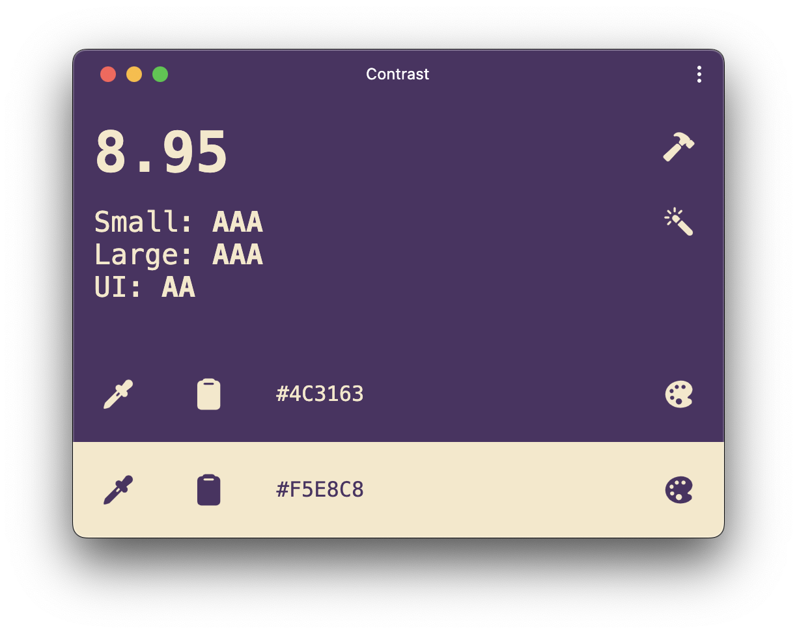

<p align="center">
   
   <h1 align="center">
      Contrast
   </h1>
</p>

<p align="center">
   Ensure colors pass WCAG Color Contrast guidelines 
   
   Contrast allows you to quickly know if foreground and background colors pass accessibility guidelines defined by the W3C. It reports if the colors chosen pass normal text, large text, and UI component requirements as well as what level they pass (A, AA, or AAA). 
</p>

<p align="center">
   
</p>

## Usage

Contrast is available on the web: http://liamdebeasi.github.io/contrast/

I recommend [installing Contrast as a Progressive Web App (PWA)](https://developer.mozilla.org/en-US/docs/Web/Progressive_web_apps/Guides/Installing#installing_pwas) for easier access. This will allow you to add a shortcut to your home screen or dock and run Contrast as a standalone application.

Contrast can also be used offline and will automatically update when bug fixes and new features are available.

## Browser Support

| Browser | Version |
| - | - |
| Safari | 16+ [^1] |
| Chrome/Edge | 100+ [^2] |
| Firefox | 100+ [^1] |

## Local Development

### Install dependencies

```shell
pnpm install
```

### Run dev server

```shell
pnpm run dev
```

### Testing Changes

Contrast uses [Playwright](https://playwright.dev) and [Axe](https://github.com/dequelabs/axe-core) for testing.

```shell
# Installs the latest browsers if needed. 
# You only need to do this on first setup and
# whenever the Playwright dependency is updated.
pnpm playwright install

# Run tests
pnpm run test
```

## Acknowledgments

Contrast was inspired by https://contrasteapp.com. Thanks for making such a great app!

[^1]: As of November 2023, Safari and Firefox do not support the [EyeDropper API](https://developer.mozilla.org/en-US/docs/Web/API/EyeDropper), so the eye dropper feature is not available in those browsers. However, using the color palette picker lets you access an eye dropper tool once the color palette picker menu appears.

[^2]: As of November 2023, there is a known bug in Blink (the engine that powers Chrome and Edge) that causes the color palette picker to not appear when Contrast is installed on macOS. This issue should be resolved with the upcoming Chrome v121 release. See https://bugs.chromium.org/p/chromium/issues/detail?id=1488347 for more information.